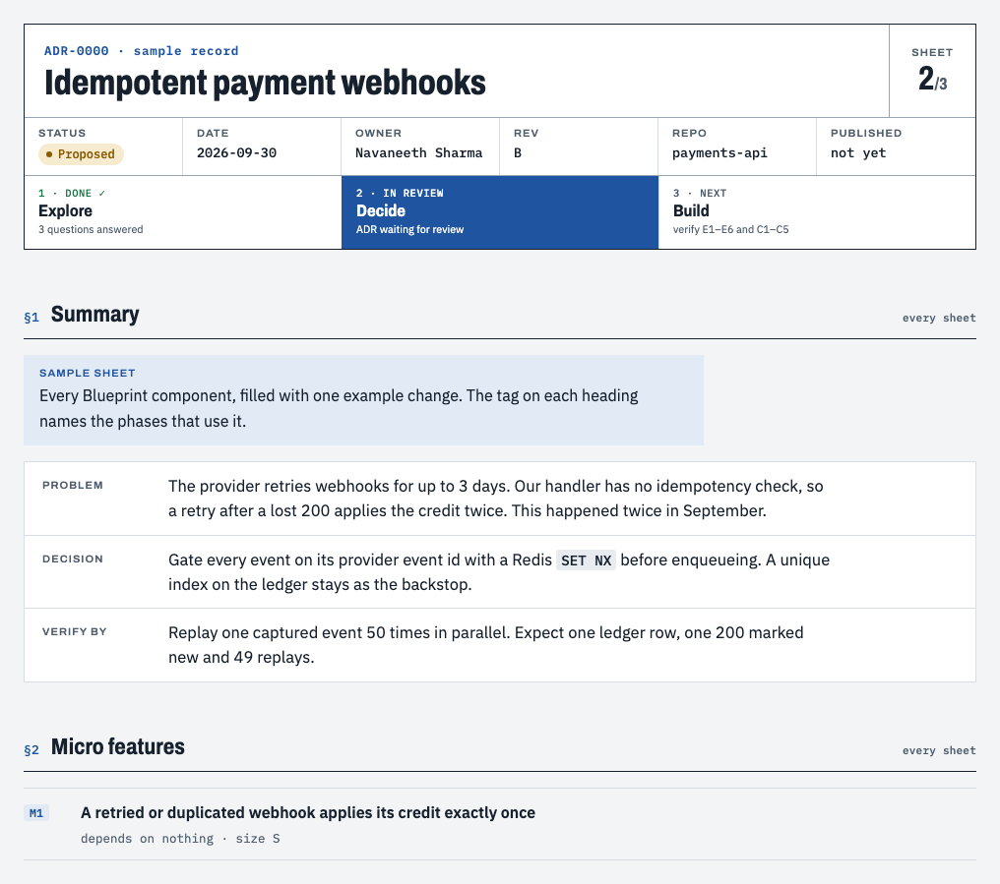
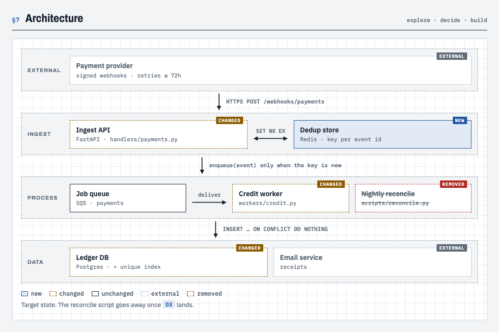
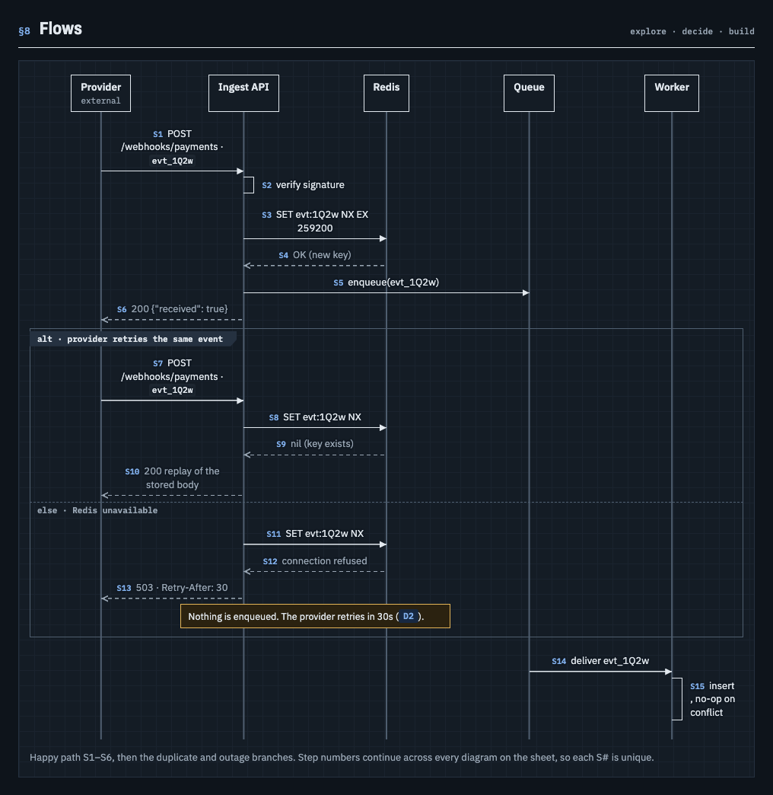
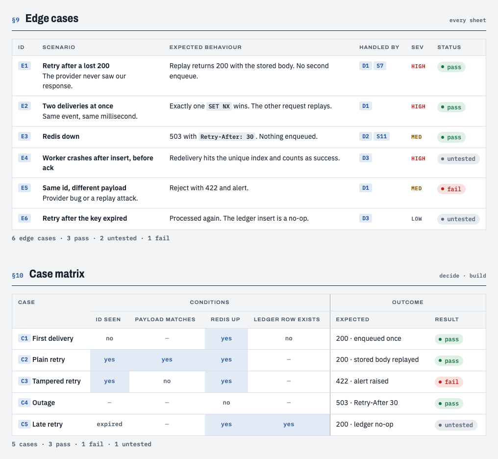

# Blueprint

[](https://github.com/Navaneeth-Sharma/blueprint/actions/workflows/test.yml)

**Explore → Decide → Build, with a sheet you can actually review at every step.**

Blueprint is a skill for coding agents (Claude Code, omp, and anything else that loads `SKILL.md` folders). It runs a change through three phases and writes one HTML sheet per phase: the research and your open questions, then the architecture decision record, then what was built and how it was verified. Each sheet has a block diagram, a sequence diagram, edge cases and a case matrix, drawn in plain HTML and CSS. There is no Mermaid and no image export.



**[Open the live component sheet →](https://navaneeth-sharma.github.io/blueprint/)**

## Why

An agent's plan usually lives in terminal scrollback. It's hard to review, it drifts from what gets built, and the edge cases get lost. Blueprint makes each phase a document you can read, comment on and link to:

- **Review gates.** Every phase stops and waits for you. Explore ends with questions, Decide ends with "accept?", and Build ends with a result for every edge case.
- **IDs that carry across phases.** Every item has an ID: F finding, O option, Q question, M micro feature, D decision, S step, E edge case, C matrix case, T task. E3 in the ADR is E3 in the build report, so you can click from a failing test back to the decision behind it.
- **Detail at the micro-feature level.** Any size of change works, but Explore breaks it into micro features, and each one gets its own flows, edge cases and decision table with exact inputs and outputs. A checklist of detail cues makes the agent ask what happens with empty input, retries, concurrent calls, timeouts, old data, permissions and logging.
- **Honest results.** Build runs the real thing (the server and curl, the CLI, a browser) and marks each case pass, fail or untested. It never marks pass for something it didn't run.

## The lifecycle

| Phase | You run | It writes | It stops when |
|---|---|---|---|
| 1 Explore | `/blueprint explore <topic>` | `explore.html`: micro features, current flow, findings with `file:line` sources, options, early edge cases, and questions with a recommended answer | you pick answers on the page. They save as you go, so next you just run decide |
| 2 Decide | `/blueprint decide` | `adr.html`: decisions, target architecture, sequence diagrams (happy path and failures), edge cases, case matrix, task plan, rollout and rollback | you accept the ADR |
| 3 Build | `/blueprint build` | `build.html`: planned vs built, as-built diagrams, a real result for every edge case and matrix case, command evidence, follow-ups | every case has a result |

Records live in your repo at `docs/adr/NNNN-slug/{explore,adr,build}.html`, next to an `index.html` that opens the furthest phase. Each sheet is a single self-contained file.

<table>
<tr>
<td width="50%"></td>
<td width="50%"></td>
</tr>
</table>



## Examples

These are real records the agents wrote while Blueprint was being tested. They're unedited, apart from being re-wrapped in the current theme and, on the older explore sheets, given the answers status line the template gained later. One local working-directory path in an evidence command is shortened to `/work/shorty`.

| Record | Agent | What it shows |
|---|---|---|
| [todo list --json](https://navaneeth-sharma.github.io/blueprint/examples/todo-json-output/) | Claude Code | The full lifecycle on a Python CLI: 15 edge cases and 8 matrix cases, all verified with `od -c`, `jq` and `cmp` against the previous commit |
| [Due dates](https://navaneeth-sharma.github.io/blueprint/examples/todo-due-dates/) | Claude Code | Answers picked on the page (`answers.json`), including a non-recommended one that the ADR follows; 20 edge cases and 15 matrix cases pass |
| [Multi-user web app](https://navaneeth-sharma.github.io/blueprint/examples/todo-web-app-split/) | Claude Code | A large request broken into 6 micro features, with 29 edge cases tagged by feature and a recommendation to split into three records |
| [Custom link alias](https://navaneeth-sharma.github.io/blueprint/examples/shorty-custom-alias/) | omp | The full lifecycle on a Node HTTP API, checked with live requests and a real server restart |
| [Link expiry](https://navaneeth-sharma.github.io/blueprint/examples/shorty-link-expiry/) | omp | Answers picked on the page, served by `serve.py` |

## Install

**Claude Code, as a plugin:**

```
/plugin marketplace add Navaneeth-Sharma/blueprint
/plugin install blueprint@blueprint
```

Installed this way, the command is namespaced as `/blueprint:blueprint explore …`.

**Claude Code and omp, from a clone** (a single `git pull` then updates both agents):

```sh
git clone https://github.com/Navaneeth-Sharma/blueprint
cd blueprint && ./install.sh
```

`install.sh` symlinks `skills/blueprint` into `~/.claude/skills` and `~/.omp/agent/skills`, whichever exist. If a copy is already there, it's moved to `~/.blueprint-backups` instead of being deleted. omp can also load Claude Code's skills directly when `skills.enableClaudeUser` is on. For any other agent, pass its skills folder: `./install.sh ~/.my-agent/skills`.

Requirements: `sh` and `python3` (standard library only). Nothing to build.

## Viewing sheets and answering questions

You answer the explore questions on the page itself, and nothing needs copying back:

- **Claude Code:** the whole record is published as one private claude.ai artifact, so the links between its sheets work. The artifact has a small database: your picks save into it as you choose them, and the agent reads them in the decide phase. You can also leave comments on the page, and the agent reads them before revising.
- **omp and other agents:** `serve.py` serves the record on `127.0.0.1` and gives you a link. Your picks save to `answers.json` in the record folder, which the agent reads (and which you can commit with the record). The server reuses itself across phases and exits after 4 hours idle. It only accepts writes from its own page and only touches `answers.json`.
- **A plain file with no server:** picks are kept in your browser, and **Copy answers** turns them into text you paste into the chat.

Reopening the page restores your last picks in all three cases.

Sheets follow your light or dark setting, work at phone width (wide diagrams and tables scroll inside their own frame), and keep working offline with system fonts.

## The sheet toolkit

The skill folder contains everything the agent uses:

| File | What it does |
|---|---|
| `SKILL.md` | The phases, gates, ID rules, micro-feature focus and detail cues |
| `template.html` | The theme and every component: title block, phase stepper, summary, callouts, findings, options, questions with Copy answers, block diagram, sequence diagram, edge-case table, case matrix, planned vs built, evidence |
| `new.sh` | Wraps the agent's `<main>` content in the theme, so CSS is never retyped and every sheet looks the same. Refuses empty input or a full page |
| `check.py` | Lints a record before each gate |
| `serve.py` | Serves records locally and saves the picks made on an explore page to `answers.json` |

`check.py` catches the mistakes agents actually make:

- broken ID links, including links between sheets, and ID chips whose text doesn't match their target
- classes that aren't in the theme, and any added `<style>`, `<script>` or inline CSS
- sequence steps that point at a missing lifeline, and an `--n` that doesn't match the actor count
- table rows with the wrong number of cells, and matrices without Expected and Result columns
- edge cases with no status, and build sheets that still say "planned"
- anything in the ADR that the build report never mentions, and record numbers that differ between sheets
- micro features that have grown too big (warning only)

```sh
python3 skills/blueprint/check.py docs/adr/0007-webhook-dedupe
```

## Development

```sh
npm ci && npx playwright install chromium webkit firefox
python3 -m unittest discover tests -v   # new.sh, check.py, serve.py, install.sh: 31 tests, including 38 lint-rule cases
node tests/browser.mjs                  # every sheet × Chromium, WebKit, Firefox × desktop, phone × light, dark
```

The browser test measures the rendered pages. It checks that every sequence arrow starts and ends on the right lifeline and points the right way, that the page never scrolls sideways on a phone, that text meets WCAG AA contrast in both themes, that an explicit theme choice overrides the OS setting, that the sheet index and tallies are correct, and that Copy answers copies what you picked. It also checks that picks save and come back after a reload in all three places: `answers.json` through `serve.py`, browser storage, and the claude.ai database (through a stand-in for the artifact runtime). Pass sheet paths to test your own records: `node tests/browser.mjs docs/adr/*/*.html`.

**End-to-end runs with a real agent** (these use your login and cost tokens):

```sh
evals/lifecycle.sh claude todo-cli 'add a --json flag to "todo list"'
evals/lifecycle.sh omp shorty 'let people choose a custom alias for a link'
```

The script seeds a fixture repo (a Python CLI or a Node HTTP API) and runs each phase in a fresh session. A browser answers the explore questions on the served page, choosing a non-recommended option so the ADR shows whether the agent really read the saved picks. Decide then runs with nothing pasted. `ANSWERS=paste` tests the Copy answers route instead. At the end, the script lints and renders every sheet the agent wrote.

**Plugin evals** (`evals/*/case.yaml`) cover nine behaviours: micro and macro explores, a request too vague to research, the skill triggering from plain language, deciding with pasted answers, with answers saved on the page, and with none, building, and refusing to build an ADR that isn't accepted.

```sh
claude plugin eval . --scaffold --trust-plugin --allow-tools Bash Write Edit --runs 1 --ablation none --no-publish
```

The eval sandbox needs a machine where Bash can be sandboxed. On macOS with Docker Desktop, its symlinked CLI plugins in `~/.docker` block that, so run the evals in CI (see `.github/workflows/evals.yml`) or on Linux with `bubblewrap` and `socat`.

## Layout

```
.claude-plugin/     plugin and marketplace manifests
skills/blueprint/   the skill: SKILL.md, template.html, new.sh, check.py, serve.py
install.sh          symlink the skill into your agents
tests/              unit tests, browser tests, fixture record
evals/              plugin eval cases, fixtures (todo-cli, shorty), lifecycle.sh
examples/           records written by real agent runs
```

## License

MIT
